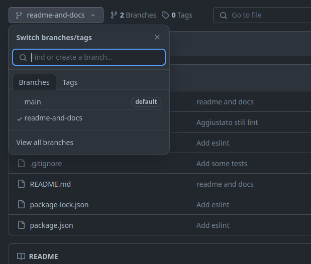
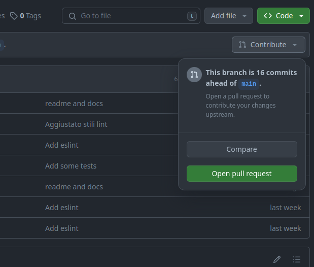
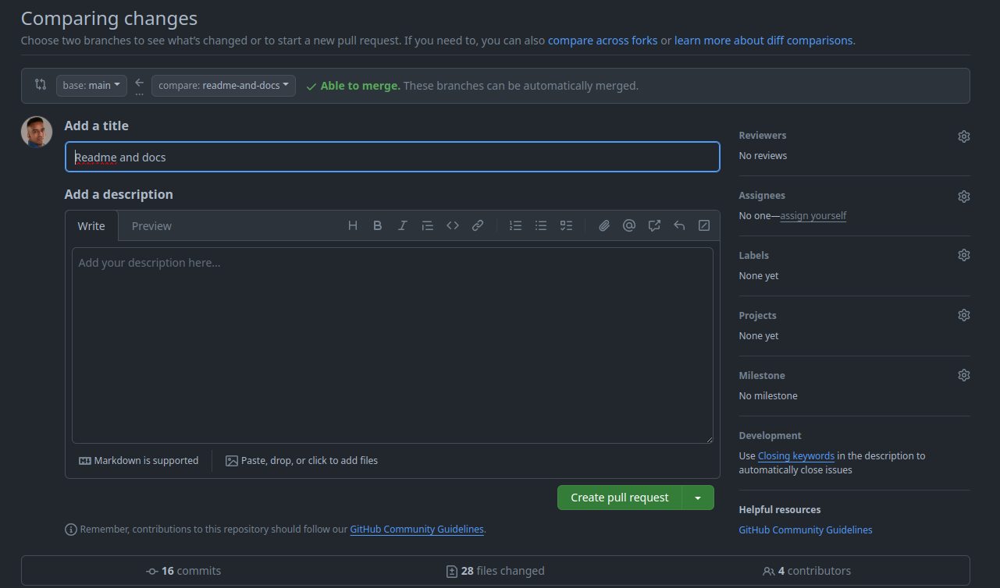
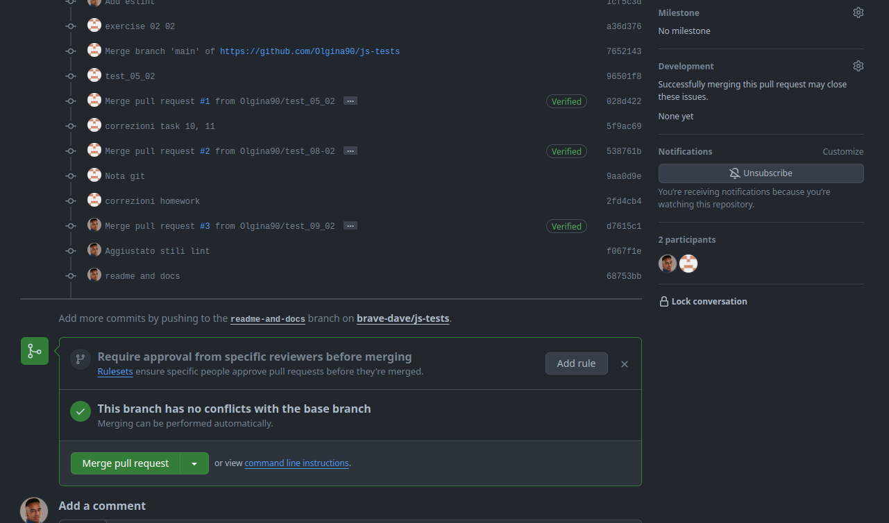

# Git

Git è un software per il controllo di versione disponibile sul terminale.

Il sistema che concede, permette di creare una cronologia dei cambiamenti dei dati dentro il repository.

## Crea il tuo branch (con base main)

- Rimuovi modifiche non commesse (:warning: Perderai tutto quello che non hai salvato.)
```sh
    git reset --hard
```

- Entra nel branch main
```sh
    git checkout main
```

- Aggiorna main
```sh
    git pull
```

- Crea il branch (Sostituisci `<nome-branch>` con il nome del branch)
```sh
    git checkout -b <nome-branch>
```

- Pubblica il branch (Sostituisci `<nome-branch>` con il nome del branch)
```sh
    git push --set-upstream origin <nome-branch>
```

## Pubblica il tuo branch online

- Commetti tutte le tue modifiche
```sh
    git add .
    git commit -m "<titolo del commit>"
```
- Spingi le modifiche online
```sh
    git push
```

## Crea una Pull request

- Entra sulla pagina della [repository](https://github.com/Olgina90/js-tests)

- Scegli il tuo branch nel selettore presente in alto a sinistra (vedi fig. 1)

(fig. 1: seleziona il branch nella repository)

- Scegli `Contribute` in alto a destra (vedi fig. 2) e poi crea una **pull request** cliccando sul tasto verde `Open **pull request**` (fig. 2)

(fig. 2: Apri **pull request** dal tuo branch)

- Aggiungi titolo, descrizione e reviewers prima di creare la **pull request** con il bottone `Create Pull Request` (fig. 3)

(fig. 3: Aggiungi dettagli **pull request** prima di aprirla)

- Ora la **pull request** e' stata creata. Una volta pronta, si puo' unirla al branch principale (main) cliccando su `Merge **pull request**` (fig. 4)

(fig. 4: Unisci il tuo branch con `main`)